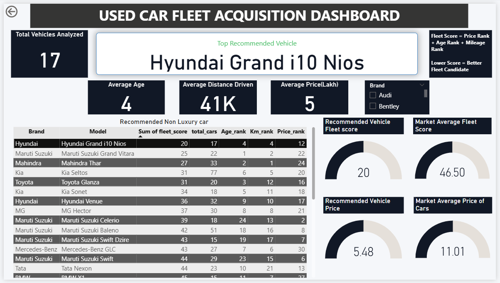
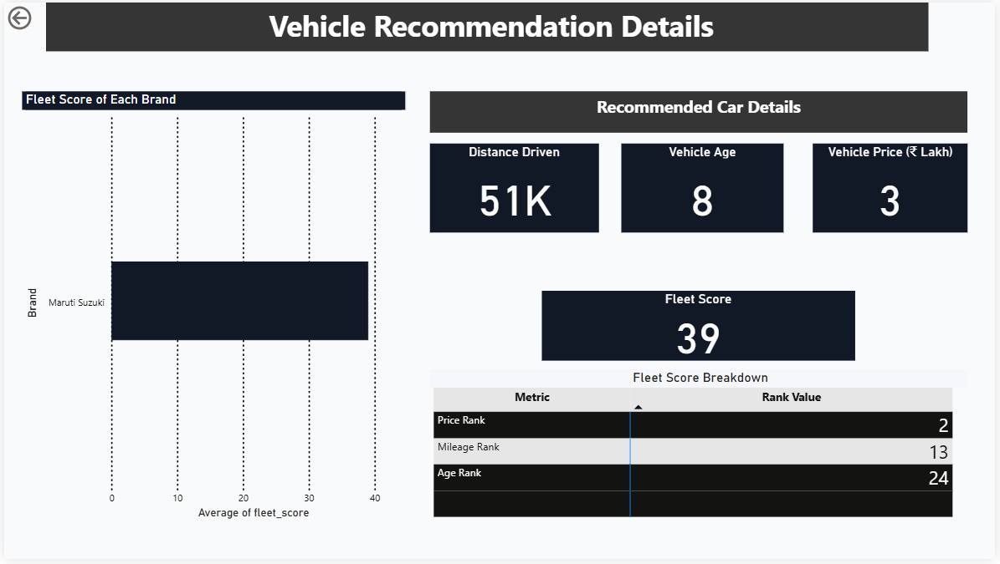
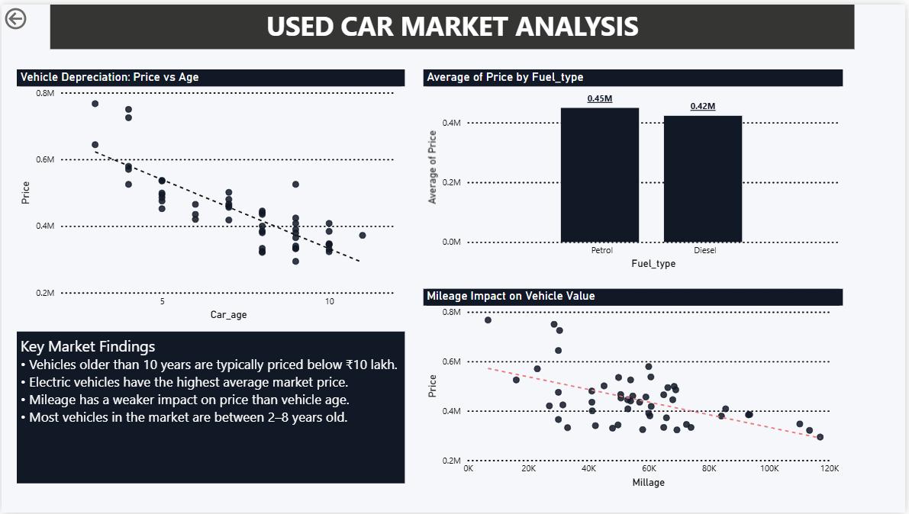

# 🚗 Used Vehicle Acquisition Intelligence System

## Project Overview

Built an end-to-end fleet acquisition intelligence system using Python and Power BI.

This solution helps fleet operators identify high-value used vehicles by evaluating:

- Vehicle Age
- Odometer Reading
- Market Price

A custom Fleet Score framework was developed to rank vehicles and recommend the most cost-effective fleet acquisition candidates.

---

## Business Problem

Fleet operators often struggle to identify vehicles that provide the best balance between cost, mileage, and age.

This project addresses that challenge by creating a data-driven vehicle ranking framework and interactive decision-support dashboard.

---

## Dataset

- Source: CarDekho
- Records Scraped: 1,669 vehicle listings
- Attributes:
  - Brand
  - Model
  - Year
  - Odometer Reading
  - Fuel Type
  - Transmission
  - Price

---

## Tools & Technologies

- Python
- BeautifulSoup
- Pandas
- Power BI
- DAX
- Power Query

---

## Methodology

### Data Collection
- Scraped vehicle listings using BeautifulSoup.

### Data Cleaning
- Removed duplicates.
- Treated mileage outliers.
- Created derived metrics.

### Feature Engineering
- Car Age
- Price per Year
- Mileage per Year
- Fleet Score

### Dashboard Development
- Executive Summary Dashboard
- Fleet Recommendation Framework
- Market Analysis Dashboard

---

## Key Results

- Scraped 1,669 vehicle listings.
- Built a Fleet Score ranking system.
- Developed interactive drill-through navigation.
- Created vehicle recommendation dashboards.
- Identified Hyundai Grand i10 Nios as the most attractive acquisition candidate based on price, age, and mileage rankings.

Developed a Fleet Score framework that reduced subjective vehicle selection and enabled data-driven acquisition decisions.

---
## Dashboard Screenshots

### Executive Dashboard

### Fleet Recommendation Framework

### Market Analysis Dashboard

